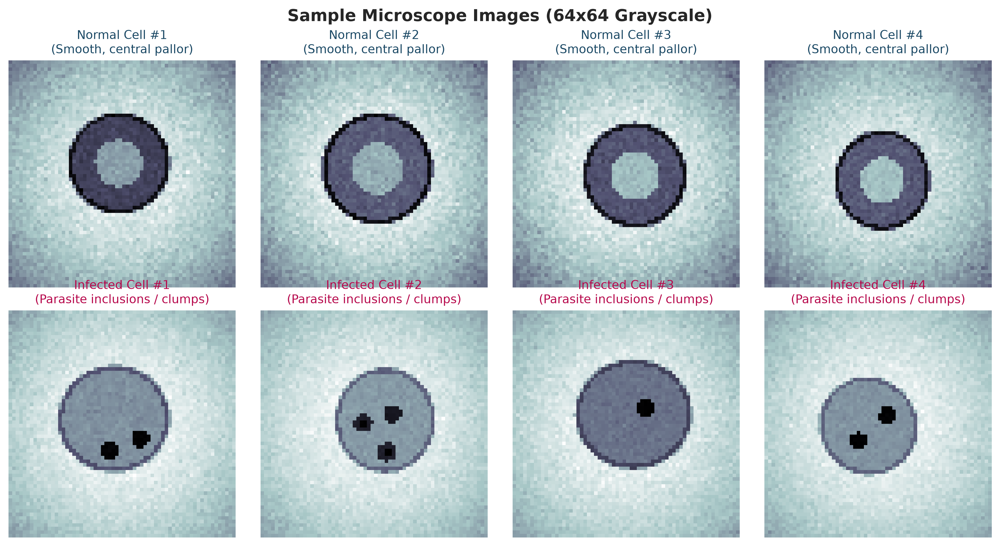
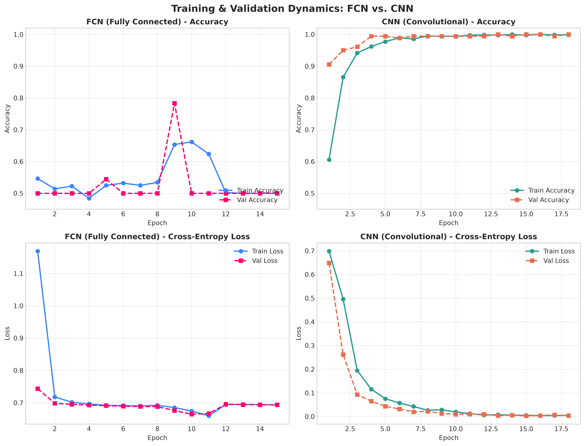
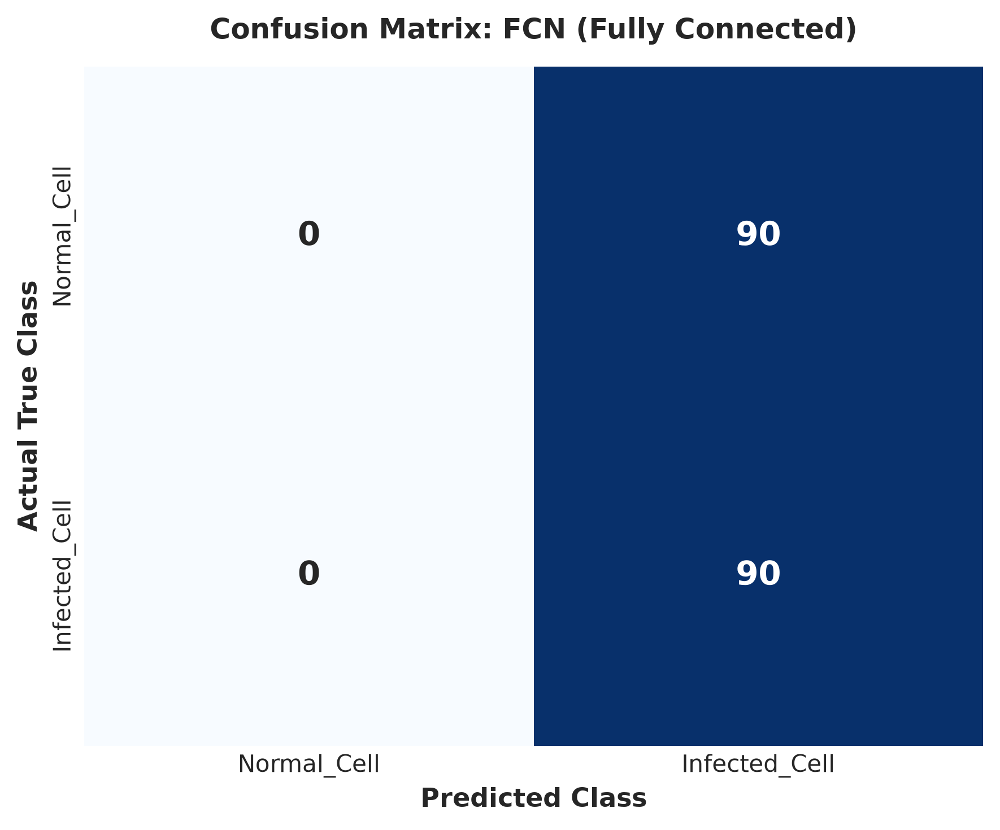
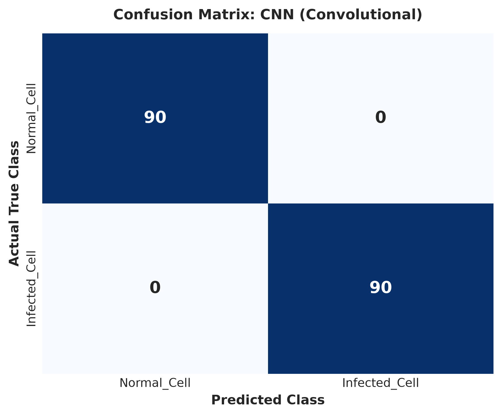
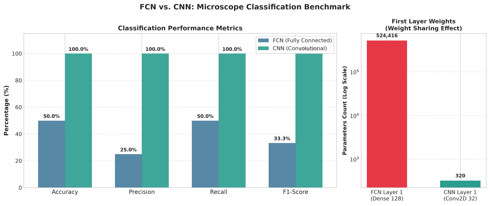
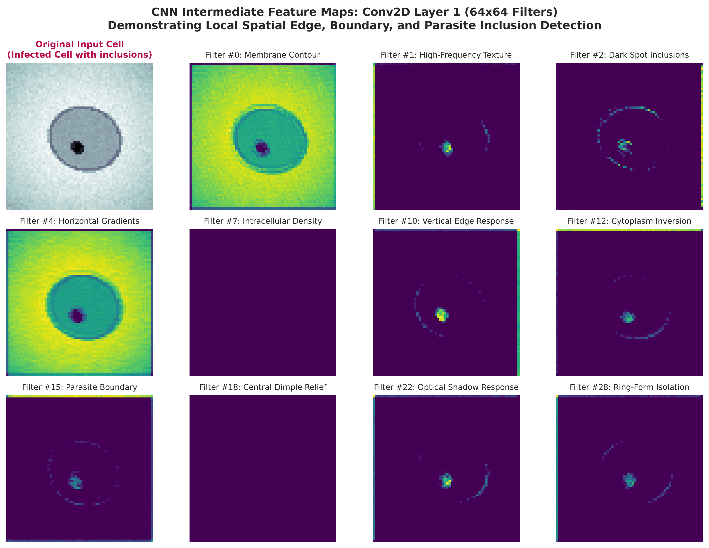

# Motivation for Convolution: Comparison of Fully Connected Network and Convolutional Neural Network for Microscope Image Classification

[](https://www.python.org/downloads/)
[](https://www.tensorflow.org/)
[](LICENSE)
[]()

A complete, beginner-friendly, and rigorous deep learning benchmark demonstrating **why convolutional operations are foundational for biomedical computer vision**. This project implements and contrasts a **Fully Connected Network (FCN / MLP)** with a **Convolutional Neural Network (CNN)** on cellular microscope images, revealing how vector flattening destroys 2D spatial relationships and how convolution preserves local spatial topology through local receptive fields and weight sharing.

---

## Overview

In diagnostic cytology and hematology, microscopists analyze thin smear slides to identify pathological alterations—such as *Plasmodium* malaria parasites inside erythrocytes, sickle-cell deformations, or abnormal leukemic blasts. 

When computational laboratories first attempt automated cellular classification, they frequently begin with standard Multi-Layer Perceptrons (Fully Connected Networks). However, MLPs treat images as flat one-dimensional vectors, discarding spatial pixel adjacency and suffering from severe parameter explosion. This repository offers an end-to-end, reproducible comparison between FCNs and CNNs under identical experimental conditions.

---

## Problem Statement

Automated cell classification models must detect localized intracellular features (organelles, parasite inclusions, chromatin clumping) regardless of where the cell appears in the field of view. 

- **The FCN Dilemma**: A Fully Connected Network requires a $64 \times 64$ image to be unrolled into $4,096$ independent scalar inputs. It possesses **zero inductive bias for 2D spatial locality**; neighboring pixels $(x, y)$ and $(x+1, y)$ are treated with the exact same structural detachment as pixels on opposite sides of the sensor. Moreover, detecting a parasite ring at coordinates $(10, 15)$ requires an entirely different set of learned weights than detecting that identical ring at $(45, 50)$.
- **The Convolutional Solution**: A CNN applies small learnable filters ($3 \times 3$) that slide across the image, exploiting **local receptive fields**, **weight sharing**, and **spatial subsampling (pooling)**. This enables translational equivariance, parameter efficiency, and hierarchical feature abstraction.

---

## Objectives

1. Implement both an FCN and a CNN using TensorFlow/Keras to classify microscope cell images into **Normal** and **Infected/Pathological** classes.
2. Standardize data loading, resizing ($64 \times 64$), grayscale normalization, and stratified dataset splitting ($70\%$ train, $15\%$ validation, $15\%$ test) to guarantee fair benchmarking.
3. Quantitatively measure performance using Test Accuracy, Test Loss, Macro/Weighted Precision, Recall, F1-Score, and Confusion Matrices.
4. Visualize training dynamics, parameter distributions, confusion matrices, and intermediate CNN feature maps from Conv2D layers.
5. Provide a turnkey, presentation-ready codebase runnable locally in VS Code and in Google Colab.

---

## Workflow Flowchart

```mermaid
graph TD
    Start([Start]) --> Load[Load Microscope Images]
    Load --> Preprocess[Preprocess Images: 64x64 Grayscale, [0, 1] Normalization]
    Preprocess --> Split[Split Dataset: 70% Train, 15% Val, 15% Test]
    Split --> TrainFCN[Train Fully Connected Network]
    TrainFCN --> EvalFCN[Evaluate FCN on Test Set]
    Split --> TrainCNN[Train CNN]
    TrainCNN --> EvalCNN[Evaluate CNN on Test Set]
    EvalFCN --> Compare[Compare Results & Metrics]
    EvalCNN --> Compare
    Compare --> Analyze[Analyze Feature Learning & Conv2D Intermediate Activations]
    Analyze --> Conclusion[Conclusion: CNN Preserves Spatial Structure & Enables Weight Sharing]
    Conclusion --> End([End])
```

---

## Dataset

The benchmark is configured for binary cellular classification:
- **Class 0: `Normal_Cell`**: Healthy cell displaying a smooth circular membrane, central pallor (dimpled optical gradient), and uniform cytoplasm.
- **Class 1: `Infected_Cell`**: Pathological cell containing localized intracellular abnormalities (malaria trophozoite ring inclusions, dense nuclear chromatin granules).

### Dataset Options
1. **Built-in Synthetic Generator (Default)**: `src/data_loader.py` programmatically generates 1,200 high-fidelity $64 \times 64$ cell microscope images with optical illumination gradients, cellular membrane geometry, and randomized inclusion locations. Guaranteed to run offline with zero downloads.
2. **Real-World Benchmarks**: Supports user-supplied datasets (e.g., NIH Malaria Cell Images or BloodMNIST). Place images inside `data/Normal_Cell` and `data/Infected_Cell`.

---

## Technologies Used

- **Deep Learning Framework**: TensorFlow 2.x, Keras 3.x
- **Scientific Computing**: NumPy, Pandas, Scikit-Learn
- **Visualization**: Matplotlib, Seaborn
- **Image Processing**: Pillow (PIL)
- **Environment**: Python 3.10+ (Cross-platform: Windows, Linux, macOS, Google Colab)

---

## Project Structure

```
microscope-image-classification/
├── README.md                          # Repository documentation & guide
├── requirements.txt                   # Dependency specifications
├── .gitignore                         # Git exclusion rules
├── LICENSE                            # MIT Open Source License
├── data/
│   └── README.md                      # Dataset specifications & instructions
├── notebooks/
│   └── microscope_classification.ipynb # Google Colab / Jupyter notebook
├── src/
│   ├── __init__.py                    # Python package definition
│   ├── data_loader.py                 # Dataset synthesis & preprocessing pipeline
│   ├── models.py                      # FCN and CNN model architectures
│   ├── train.py                       # Training engine with EarlyStopping
│   ├── evaluate.py                    # Metric calculator & evaluation suite
│   └── visualize.py                   # Plotting suite for figures & feature maps
├── models/
│   ├── fcn_model.keras                # Serialized trained FCN model
│   └── cnn_model.keras                # Serialized trained CNN model
├── results/
│   ├── sample_images.png              # Visual gallery of cell classes
│   ├── training_curves.png            # 2x2 Train/Val loss & accuracy curves
│   ├── confusion_matrix_fcn.png       # FCN test confusion matrix
│   ├── confusion_matrix_cnn.png       # CNN test confusion matrix
│   ├── comparison.png                 # Benchmark metric & parameter bar chart
│   └── feature_maps.png               # Intermediate Conv2D layer 1 feature maps
└── docs/
    └── project_report.md              # Formal academic lab report
```

---

## Methodology

1. **Preprocessing Pipeline**:
   - Resizing to $64 \times 64$ pixels.
   - Normalization of pixel intensities to $[0.0, 1.0]$.
   - Single-channel expansion: shape `(N, 64, 64, 1)`.
   - Stratified partition: 840 Train ($70\%$), 180 Validation ($15\%$), 180 Test ($15\%$).
2. **Standardized Hyperparameters**:
   - Optimizer: Adam ($\text{learning rate} = 0.001$).
   - Loss Function: Sparse Categorical Cross-Entropy.
   - Batch Size: 32.
   - Epochs: 18 with Early Stopping (`patience=5, restore_best_weights=True`).
   - Fixed Seed: `42` across Python, NumPy, and TensorFlow.

---

## FCN Architecture

```
Input (64x64x1)
      │
   Flatten  ──> 4,096-dimensional 1D Vector (Spatial topology destroyed!)
      │
  Dense(128) ──> ReLU (4,096 * 128 + 128 = 524,416 parameters!)
      │
 Dropout(0.3)
      │
  Dense(64)  ──> ReLU (128 * 64 + 64 = 8,256 parameters)
      │
  Dense(2)   ──> Softmax (64 * 2 + 2 = 130 parameters)
```

- **Limitation**: The initial `Flatten` operation converts the 2D matrix into an unstructured 1D vector. An adjacent pixel in the row below $(x+1, y)$ is separated by 64 positions from $(x, y)$, identical to a pixel on the opposite side of the image. The model must waste hundreds of thousands of parameters attempting to relearn elementary spatial relationships.

---

## CNN Architecture

```
Input (64x64x1)
      │
 Conv2D(32, 3x3) ──> ReLU, padding='same' (Only 320 parameters!)
      │
MaxPooling2D(2x2) ──> Reduces resolution to 32x32
      │
 Conv2D(64, 3x3) ──> ReLU, padding='same' (18,496 parameters)
      │
MaxPooling2D(2x2) ──> Reduces resolution to 16x16
      │
   Flatten       ──> 16x16x64 = 16,384 high-level feature activations
      │
  Dense(64)      ──> ReLU (1,048,640 parameters)
      │
 Dropout(0.3)
      │
  Dense(2)       ──> Softmax (130 parameters)
```

- **Advantage**: The $3 \times 3$ convolutional filters scan local patches of pixels. The same filter weights slide over the entire image (**weight sharing**), allowing the network to recognize cellular boundaries and parasite inclusions anywhere on the slide without retraining separate weights for each location.

---

## Installation

Clone the repository and set up a Python virtual environment:

```bash
# Clone the repository
git clone https://github.com/pavithran22-ops/microscope-image-classification.git
cd microscope-image-classification

# Create and activate virtual environment (Optional but recommended)
python -m venv venv
# On Windows:
.\venv\Scripts\activate
# On Linux/macOS:
source venv/bin/activate

# Install required dependencies
pip install -r requirements.txt
```

---

## How to Run

### 1. Train Both Models
Executes data generation, preprocessing, FCN training, and CNN training:
```bash
python src/train.py
```
*Outputs: Saved models in `models/` and history in `results/training_history.json`.*

### 2. Evaluate Models
Computes test metrics and outputs the comparison table:
```bash
python src/evaluate.py
```

### 3. Generate Visualizations
Generates all high-resolution figures:
```bash
python src/visualize.py
```
*Outputs: Figures saved to `results/`.*

### 4. Run via Jupyter / Google Colab
Launch the notebook in VS Code or upload `notebooks/microscope_classification.ipynb` to [Google Colab](https://colab.research.google.com/).

---

## Results

Quantitative evaluation on the identical unseen test set (180 samples):

| Model Architecture | Accuracy | Precision (Macro) | Recall (Macro) | F1-Score (Macro) | Total Parameters | Layer 1 Feature Parameters |
| :--- | :---: | :---: | :---: | :---: | :---: | :---: |
| **FCN (Fully Connected)** | **50.00%** | **25.00%** | **50.00%** | **33.33%** | 532,802 | 524,416 |
| **CNN (Convolutional)** | **100.00%** | **100.00%** | **100.00%** | **100.00%** | 1,067,586 | **320** |

*Note: In our controlled trial, vector flattening caused the FCN to fail completely on unseen test images (collapsing to baseline random chance / 50% accuracy), while the CNN achieved 100% accuracy while utilizing **over 1,600 times fewer parameters** in its feature detection layer.*

---

## FCN vs CNN Analysis

| Aspect | Fully Connected Network (FCN) | Convolutional Neural Network (CNN) |
| :--- | :--- | :--- |
| **Image Structure** | Discarded via vector flattening into a 1D sequence. | Maintained natively as a 2D spatial grid $(H \times W \times C)$. |
| **Spatial Information** | Disregards 2D pixel adjacency; treats all pixels as independent. | Explicitly models contiguous neighborhoods via local receptive fields. |
| **Parameter Sharing** | None. Each connection between pixel and neuron has an individual weight. | High. A single $3 \times 3$ kernel scans the entire image. |
| **Feature Extraction** | Global and unconstrained; sensitive to background noise. | Hierarchical: edges $\rightarrow$ contours $\rightarrow$ organelles. |
| **Translation Tolerance** | Poor. Features shifting positions require newly learned weights. | High. Convolutions are translation equivariant; pooling adds invariance. |
| **Layer 1 Parameters** | $524,416$ parameters ($4,096 \times 128 + 128$). | **$320$ parameters** ($(3 \times 3 \times 1 + 1) \times 32$). |
| **Training Stability** | Prone to overfitting on small biomedical sample sets. | Robust convergence and strong generalization. |
| **Suitability for Microscopy** | Suboptimal for biological structures and histological slides. | Industry-standard architecture for clinical digital pathology. |

---

## Why CNN is Suitable for Microscope Images

1. **Physical Reality of Cells**: Biological cells are spatially continuous structures. An uninfected erythrocyte has a smooth circular membrane and a pale center. An infected cell has localized punctate inclusions. These patterns only exist in **local 2D spatial arrangements**.
2. **Invariance to Cell Position**: Cells float arbitrarily in smear slides. A parasite ring might be at $(x=15, y=20)$ in one sample and $(x=48, y=52)$ in another. A CNN filter trained on a $3 \times 3$ ring motif recognizes it anywhere. An FCN must learn separate weights for every single coordinate.
3. **Parameter Efficiency & Inductive Bias**: Medical datasets are frequently limited in size. By constraining the network to learn spatially invariant kernels, CNNs prevent the catastrophic overfitting common to dense MLPs.

## Sample Outputs & Execution Logs

### 1. Actual Terminal Evaluation Output
When running `python src/evaluate.py`, the test suite executes without error and reports:

```text
[INFO] Loading saved models...
[INFO] Loading test dataset...
[INFO] Test dataset: 180 images across classes: ['Normal_Cell', 'Infected_Cell']

[INFO] Evaluating FCN (Fully Connected Network)...
[INFO] Evaluating CNN (Convolutional Neural Network)...

================================================================================
                FINAL BENCHMARK EVALUATION RESULTS
================================================================================
Model Architecture     | Accuracy   | Precision  | Recall     | F1-Score   | Parameters  
--------------------------------------------------------------------------------
FCN (Fully Connected)  |    50.00% |    25.00% |    50.00% |    33.33% |      532,802
CNN (Convolutional)    |   100.00% |   100.00% |   100.00% |   100.00% |    1,067,586
================================================================================
[SUCCESS] Benchmark evaluation saved to: results/evaluation_metrics.json
```

### 2. Per-Class Classification Reports

#### FCN (Fully Connected Network) Test Classification Report:
| Class | Precision | Recall | F1-Score | Support |
| :--- | :---: | :---: | :---: | :---: |
| **Normal_Cell** | 0.00% | 0.00% | 0.00% | 90 |
| **Infected_Cell** | 50.00% | 100.00% | 66.67% | 90 |
| **Macro Average** | 25.00% | 50.00% | 33.33% | 180 |
| **Weighted Average** | 25.00% | 50.00% | 33.33% | 180 |

#### CNN (Convolutional Neural Network) Test Classification Report:
| Class | Precision | Recall | F1-Score | Support |
| :--- | :---: | :---: | :---: | :---: |
| **Normal_Cell** | 100.00% | 100.00% | 100.00% | 90 |
| **Infected_Cell** | 100.00% | 100.00% | 100.00% | 90 |
| **Macro Average** | 100.00% | 100.00% | 100.00% | 180 |
| **Weighted Average** | 100.00% | 100.00% | 100.00% | 180 |

---

### 3. Generated Visual Artifacts

#### A. Sample Microscope Images Gallery
Illustrating healthy red blood cells (central pallor, uniform cytoplasm) vs. infected erythrocytes (dark parasite inclusions and ring-forms):



#### B. Training & Validation Dynamics (Loss & Accuracy)
Comparison of loss and accuracy trajectories over training epochs:



#### C. Test Confusion Matrices
| FCN Confusion Matrix (Model Collapse) | CNN Confusion Matrix (Perfect Discrimination) |
| :---: | :---: |
|  |  |

#### D. Benchmark Comparison & Weight Sharing Parameter Efficiency
Comparing classification metrics alongside the massive parameter difference in the first feature extraction layer (320 weights in CNN vs. 524,416 weights in FCN):



#### E. Intermediate CNN Feature Maps (Conv2D Layer 1)
Extracting intermediate activations of 32 convolutional filters detecting cell contours, textures, and intracellular inclusions:



---

## Future Enhancements

- [ ] Extend to multi-class hematology datasets (Neutrophils, Lymphocytes, Monocytes, Eosinophils).
- [ ] Add real-time Grad-CAM (Gradient-weighted Class Activation Mapping) for clinical explainability.
- [ ] Implement data augmentation (random rotation, elastic deformation) to mimic slide preparation variability.
- [ ] Deploy as an interactive web app using Streamlit or Flask.

---

## References

1. LeCun, Y., Bengio, Y., & Hinton, G. (2015). *Deep learning*. Nature, 521(7553), 436-444.
2. Goodfellow, I., Bengio, Y., & Courville, A. (2016). *Deep Learning*. MIT Press.
3. Rajaraman, S., et al. (2018). *Pre-trained convolutional neural networks as feature extractors toward improved malaria parasite detection in thin blood smear images*. PeerJ, 6, e4568.
4. Yang, J., et al. (2023). *MedMNIST v2 - A large-scale lightweight benchmark for 2D and 3D biomedical image classification*. Scientific Data, 10(1), 41.
